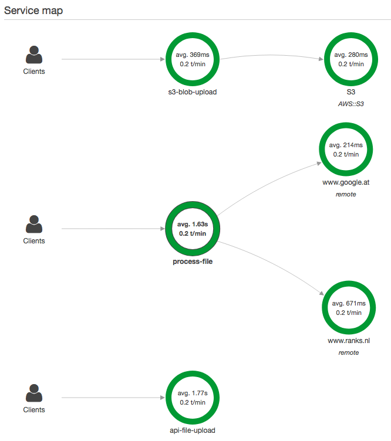
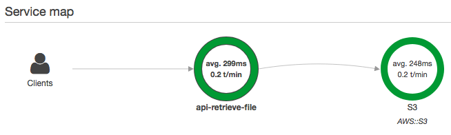
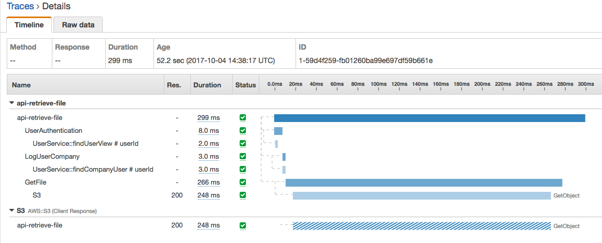

# Apache Camel Sample Application using REST DSL and Spring Security

This project contains an advanced setup of an Apache Camel driven application which used the REST DSL feature to provide some services exposed via Jetty. It also uses Spring security to restrict access to certain routes. Note however, that this project is a tech demo rather than a production-ready application!

An invoked Camel route exposed via REST DSL will extract user credentials from a received `Authorization` HTTP header and retrieve the user information from a MongoDB based authentication provider and user details service if the route invokes the `SpringSecurityContextLoader` bean and defines one of the two currently available authorization policies defined in the `SpringSecurityConfig`. Currently only the `SampleFileRoute` does make use of this feature as it will upload files to an S3 bucket and download the file again on retrieving details on an uploaded file. 

The `SampleFileRoute` will process an incoming file by downloading an English stop-word list from the Internet, if not already done before, and split the content of the uploaded file into terms. Each term is checked against the English stop-word list and only if it passes it is added to a term frequency map. The 5 most frequently used terms are used to perform a search result at google. This gathered information will be enriched into the uploaded document and stored in MongoDB. 

Within this application, users contain two different approaches on how to store sensitive data via MongoDB/Morphia. Passwords are hashed in a way that they are very unlikely to get converted back to their original form and `PasswordAuthenticationProvider` will actually perform a check of a provided password, after hashing it, with the stored password hash. User keys on the other hand are hashed also but stored with a salt value in order to convert the key later on back to its original form. `UserKeyAuthenticationProvider` therefore will check the provided user key with the one stored in the database (the unhashed value of it).

While the actual work done by this application is more or less meaningless, the respective beans invoked are monitored by and visualized in Amazon XRay. In order to keep track of the respective steps done while processing a task, the application uses a Camel routing policy handled by `XRayTracer`, which will create a new AWS segment once a new exchange is created, and Spring AOP aspect weaving, where `MonitorServicesAspect` will intercept any invocation of a service method and create a new AWS XRay subsegment which will appear in the graphical overview as sub entry in a respective trace view.

The application presented here is primarily intended to play around with certain features and see how these play in together.

Note: The actual application configuration properties are excluded as they contain real AWS credentials!

## API Usage

### Check for online status

- Request

```curl -XGET -k "https://localhost:8080/api/health"```

- Response

```Services is up and running```


### Deliver documents

- Request

```curl -XPOST --user admin:ADMINKEY -H "Content-Type: application/octet-stream" -H "Content-Disposition: attachment; filename=someFile.xml" -k "https://localhost:8080/api/files" --data-binary "@/path/to/file"```

- Response

```{"uuid":"a3569d23-83c1-42bd-ad08-1bf8974ffa6c"}```

- TODO:

This should probably get replaced by a `201 Created` HTTP response containing a `Location` HTTP header with the URI of the created file resource instead of the plain URI.

### List documents

- Request

```curl -XGET --user admin:ADMINKEY -H "Accept: application/json" -k "https://localhost:8080/api/files?limit=5&offset=20" | json_pp ```

- Response

```
{
      "files" : [
         {
            "size" : 764,
            "name" : "spring_security_acl_mongodb.json",
            "createdAt" : "2017-08-30T10:48:56Z",
            "_links": {
                "self" : {
                    "href" : "https://localhost:8080/api/files/5fb59bb9-15dd-4254-92a3-d8ca20daec67"
                }
            }
         },
         {
            "name" : "spring_security_acl_mongodb.json",
            "createdAt" : "2017-08-30T10:48:56Z",
            "_links": {
                "self" : {
                    "href" : "https://localhost:8080/api/files/25a7987d-76f9-4359-837b-0307ab85f1d4"
                }
            },
            "size" : 764
         },
         {
            "size" : 764,
            "_links": {
                "self" : {
                    "href" : "https://localhost:8080/api/files/d02c55d8-b827-43ae-affb-b0a4d8c499e1"
                }
            },
            "createdAt" : "2017-08-30T10:48:57Z",
            "name" : "spring_security_acl_mongodb.json"
         },
         {
            "createdAt" : "2017-08-30T10:48:58Z",
            "_links": {
                "self" : {
                    "href" : "https://localhost:8080/api/files/fc083ae3-2994-4b39-8820-46ff7107a46c"
                }
            },
            "name" : "spring_security_acl_mongodb.json",
            "size" : 764
         },
         {
            "name" : "spring_security_acl_mongodb.json",
            "_links": {
                "self" : {
                    "href" : "https://localhost:8080/api/files/3cec3700-4f4a-4f17-aea3-2b445cb625e8"
                }
            },
            "createdAt" : "2017-08-30T10:48:59Z",
            "size" : 764
         }
      ],
      "_links": {
          "self" : {
              "href" : "https://localhost:8080/api/files?limit=5&offset=20"
          },
          "last" : {
              "href" : "https://localhost:8080/api/files?limit=5&offset=30"
          },
          "next" : {
              "href" : "https://localhost:8080/api/files?limit=5&offset=25"
          },
          "prev" : {
              "href" : "https://localhost:8080/api/files?limit=5&offset=15"
          },
          "first" : {
              "href" : "https://localhost:8080/api/files?limit=5&offset=0"
          }
      }
   }
```

### Document details

- Request

```curl -XGET --user admin:ADMINKEY -H "Accept: application/json" -k "https://localhost:8080/api/files/3cec3700-4f4a-4f17-aea3-2b445cb625e8" | json_pp```

- Response

```
{
   "name" : "someFile.xml",
   "content" : "Rm9yZXZlcgpCeSBUZXJyaSBOaWNvbGUgVGhhcnJpbmd0b24KCkZvcmV2ZXIgd2UgcmVtYWluIG9ibGl2aW91cyB0byB0aGUgZnV0dXJlLApsb3N0IHRvIHRoZSBwYXN0IGFuZCBlbmR1cmluZyBvdXIgdG9ydHVyZS4KRm9yZXZlciB3ZSB0YWtlIGNoYW5jZXMgdG8gc2V0dGxlIG91ciBzY29yZXMsCmxvc2luZyBzb21lIGJhdHRsZXMgYW5kIHdpbm5pbmcgc29tZSB3YXJzLgpGb3JldmVyIHByYXlpbmcgb3V0IGxvdWQgaG9waW5nIHNvbWVvbmUgd2lsbCBoZWFyLApmb3JldmVyIGNyeWluZyBzb2Z0bHkgYnV0IG5ldmVyIHNoZWRkaW5nIGEgdGVhci4KRm9yZXZlciBleGlzdHMgYmVoaW5kIGEgZGlzZ3Vpc2UsCmJ1dCB0aGUgYmVsaWVmIGluIGZvcmV2ZXIga2VlcHMgb3VyIGhlYXJ0cyBhbGl2ZS4=",
   "createdAt" : "2017-10-04T14:32:50Z",
   "_embedded" : {
      "searchResults" : [
         {
            "subHead" : "17 Jan 2015 ... Forever by: Terri Nicole Tharrington ... -Forever we take chances to settle our  scores, ... -but the belief in forever keeps our hearts alive.",
            "_links" : {
               "url" : {
                  "href" : "https://prezi.com/jcogzajrawo1/forever-by-terri-nicole-tharrington/&amp;sa=U&amp;ved=0ahUKEwjF0OrTl9fWAhWEAsAKHZkSDv8QFggWMAA&amp;usg=AOvVaw2ifrD1X9XjAenN_X_AbnUd",
                  "title" : "Forever by: Terri Nicole Tharrington by melissa ledoux on Prezi"
               },
               "cite" : {
                  "href" : "https://prezi.com/jcogzajrawo1/forever-by-terri-nicole-tharrington/"
               }
            }
         },
         {
            "subHead" : "Forever we remain oblivious to the future, / lost to the past and enduring our  torture. / Forever we take chances to settle our scores, / losing some battles and  winning some wars. ... but the belief in forever keeps our hearts alive. Embed.  Submit.",
            "_links" : {
               "cite" : {
                  "href" : "https://genius.com/Terri-nicole-tharrington-forever-annotated"
               },
               "url" : {
                  "title" : "Terri Nicole Tharrington – Forever | Genius",
                  "href" : "https://genius.com/Terri-nicole-tharrington-forever-annotated&amp;sa=U&amp;ved=0ahUKEwjF0OrTl9fWAhWEAsAKHZkSDv8QFggdMAE&amp;usg=AOvVaw1FnEFopEK1HeLHkAWYtGkJ"
               }
            }
         },
         {
            "_links" : {
               "url" : {
                  "title" : "Short Poem About Forever - Family Friend Poems",
                  "href" : "https://www.familyfriendpoems.com/poem/short-poem-about-forever&amp;sa=U&amp;ved=0ahUKEwjF0OrTl9fWAhWEAsAKHZkSDv8QFggiMAI&amp;usg=AOvVaw28cl5SoH7enMlj7jUZ9eeh"
               },
               "cite" : {
                  "href" : "https://www.familyfriendpoems.com/.../short-poem-about-forever"
               }
            },
            "subHead" : "My name is Terri Nicole Tharrington. I am in the ... Forever we take chances to  settle our scores, losing some ... but the belief in forever keeps our hearts alive."
         },
         {
            "_links" : {
               "url" : {
                  "title" : "Forever - SparkPeople",
                  "href" : "http://www.sparkpeople.com/mypage_public_journal_individual.asp%3Fblog_id%3D5519052&amp;sa=U&amp;ved=0ahUKEwjF0OrTl9fWAhWEAsAKHZkSDv8QFggoMAM&amp;usg=AOvVaw3oHaIME4R9zOuX9KYwbIFh"
               },
               "cite" : {
                  "href" : "www.sparkpeople.com/mypage_public_journal_individual.asp?..."
               }
            },
            "subHead" : "21 Oct 2013 ... Terri Nicole Tharrington Forever we remain ... Forever we take chances to settle  our scores, ... but the belief in forever keeps our hearts alive."
         },
         {
            "_links" : {
               "cite" : {
                  "href" : "xxxpoemhub.blogspot.com/2016/02/forever-analysis.html"
               },
               "url" : {
                  "title" : "PoemHub&#39;s Blogs: Forever Analysis",
                  "href" : "http://xxxpoemhub.blogspot.com/2016/02/forever-analysis.html&amp;sa=U&amp;ved=0ahUKEwjF0OrTl9fWAhWEAsAKHZkSDv8QFggvMAQ&amp;usg=AOvVaw2SPE08Qwy5hpk_dmCSmtpP"
               }
            },
            "subHead" : "17 Feb 2016 ... Forever we take chances to settle our scores, losing some battles and ... but the  belief in forever keeps our hearts alive. Forever is a short ... It was written by war  veteran Terri Nicole Tharrington in 2012. As an american war&nbsp;..."
         },
         {
            "_links" : {
               "url" : {
                  "title" : "Poetic Garden of Eden: &quot;Forever&quot; - By Terri Nicole Tharrington",
                  "href" : "http://poeticgoe.blogspot.com/2016/01/forever-by-terri-nicole-tharrington.html&amp;sa=U&amp;ved=0ahUKEwjF0OrTl9fWAhWEAsAKHZkSDv8QFgg1MAU&amp;usg=AOvVaw3sRa_9iJbqWEwpg4tVJyAG"
               },
               "cite" : {
                  "href" : "poeticgoe.blogspot.com/.../forever-by-terri-nicole-tharrington.html"
               }
            },
            "subHead" : "1 Jan 2016 ... &quot;Forever&quot; - By Terri Nicole Tharrington ... Forever we take chances to settle our  scores, ... but the belief in forever keeps our hearts alive."
         },
         {
            "subHead" : "Seattle Sounders page on FlashScore.com offers livescore, results, standings  and match details (goal scorers, red cards, …).",
            "_links" : {
               "url" : {
                  "title" : "Seattle Sounders live scores, results, fixtures, Seattle Sounders v FC ...",
                  "href" : "http://www.flashscore.com/team/seattle-sounders/6P5S63Ah/&amp;sa=U&amp;ved=0ahUKEwjF0OrTl9fWAhWEAsAKHZkSDv8QFgg7MAY&amp;usg=AOvVaw2az0Nl09t8IIr0mIvVYh07"
               },
               "cite" : {
                  "href" : "www.flashscore.com/team/seattle-sounders/6P5S63Ah/"
               }
            }
         },
         {
            "_links" : {
               "cite" : {
                  "href" : "https://www.wattpad.com/31075398-poems-for-teens-forever"
               },
               "url" : {
                  "title" : "Poems for teens - Forever - Wattpad",
                  "href" : "https://www.wattpad.com/31075398-poems-for-teens-forever&amp;sa=U&amp;ved=0ahUKEwjF0OrTl9fWAhWEAsAKHZkSDv8QFghBMAc&amp;usg=AOvVaw0Z0eT6CIxSOdDFRP4FARdj"
               }
            },
            "subHead" : "Read Forever from the story Poems for teens by JordanPride19 with 40 ... Terri  Nicole Tharrington Forever we remain oblivious to the future, ... Forever we take  chances to settle our scores, + ... but the belief in forever keeps our hearts alive. + ."
         },
         {
            "_links" : {
               "cite" : {
                  "href" : "https://www.wattpad.com/.../31818841-captured-slowly-editing-completed"
               },
               "url" : {
                  "title" : "Captured (slowly editing) Completed - StillDreaming423 - Wattpad",
                  "href" : "https://www.wattpad.com/story/31818841-captured-slowly-editing-completed&amp;sa=U&amp;ved=0ahUKEwjF0OrTl9fWAhWEAsAKHZkSDv8QFghGMAg&amp;usg=AOvVaw18xTAC3ub4jG7SaV1sZgzr"
               }
            },
            "subHead" : "Forever we take chances to settle our score, losing some battles and winn... ...  Forever exist behind a disguise, but the belief in forever keeps our hearts alive."
         },
         {
            "_links" : {
               "url" : {
                  "href" : "https://shoshanaweb.wordpress.com/about/&amp;sa=U&amp;ved=0ahUKEwjF0OrTl9fWAhWEAsAKHZkSDv8QFghLMAk&amp;usg=AOvVaw2IQPmgsHPBhoeNSMycYda8",
                  "title" : "About – shoshana"
               },
               "cite" : {
                  "href" : "https://shoshanaweb.wordpress.com/about/"
               }
            },
            "subHead" : "Forever we take chances to settle our scores, losing some battles ... behind a  disguise, but the belief in forever keeps our hearts alive. -Terri Nicole Tharrington &nbsp;..."
         }
      ]
   },
   "_links" : {
      "self" : {
         "href" : "https://localhost:8080/api/files/5804f658-46bc-4f0d-94e3-34639a8900d6"
      }
   },
   "size" : 395
}
```

## Mongo View collections

This application uses MongoDB views on the user collection which load only necessary data for either the authentication process or for preventing Morphia from automatically loading referenced collections in the back on accessing certain fields, as this might avoid custom caching strategies.

The currently required views can be created as follows:

- User view used for authentication:

```db.createView( "authUserView", "user", [ { $project: { "userId": 1, "userKeyEncrypted": 1, "uuid":1, "roles": 1, "passwordHash": 1, "disabled": 1 } } ] )```

- User view which replaces MongoDB's DBRef construct with a simple UUID replacement of the referenced company

```
db.createView( "companyUserView", "user", [
       { $project: { "userId": 1, "userKeyEncrypted": 1, "uuid":1, "roles": 1, "passwordHash": 1, "disabled": 1, company: { $objectToArray: "$$ROOT.company" }} }, 
       { $unwind: "$company" }, 
       { $match: { "company.k": "$id"}  }, 
       { $lookup: { from: "company", localField: "company.v", foreignField: "_id", as: "company_data" } },
       { $project: { "userId": 1, "userKeyEncrypted": 1, "uuid":1, "roles": 1, "passwordHash": 1, "disabled": 1,  "companyUuid": { $arrayElemAt: [ "$company_data.uuid", 0 ] } } }
   ])
   ```

or 

```
db.createView( "companyUserView", "user", [
    { $project: { "userId": 1, "userKeyEncrypted": 1, "uuid":1, "roles": 1, "passwordHash": 1, "disabled": 1, companyRefs: { $let: { vars: { refParts: { $objectToArray: "$$ROOT.company" }}, in: "$$refParts.v" } } } }, 
    { $match: { "companyRefs": { $exists: true } } }, 
    { $project: { "userId": 1, "userKeyEncrypted": 1, "uuid":1, "roles": 1, "passwordHash": 1, "disabled": 1, "companyRef": { $arrayElemAt: [ "$companyRefs", 1 ] } } }, 
    { $lookup: { from: "company", localField: "companyRef", foreignField: "_id", as: "company_data" } }, 
    { $project: { "userId": 1, "userKeyEncrypted": 1, "uuid":1, "roles": 1, "passwordHash": 1, "disabled": 1,  "companyUuid": { $arrayElemAt: [ "$company_data.uuid", 0 ] } } }
])
```

## AWS XRay

### File uploads

Service Map after uploading a new file via the application (still WIP) which currently tracks HTTP invocations and service invocations that internally use MongoDB.



The corresponding trace to the above mentioned file upload can be seen below. As the same `TRACE_ID` is used for 


### Retrieving file details

For requesting details of a certain uploaded file AWS XRay will present a graph like this:



and a trace output similar to this



## TODO:

Certain things I want to get up and running are:

- File uploads should return a 201 with a location header of the URI to look up the file again (easy to fix but not yet done)
- Camel-Spring-Security uses its own way to decide if a route may be invoked by a user or not (via the `.policy(...)` route definition) though this does not respect any settings done in traditional spring security where certain endpoints are either declared to require authentication or that authentication should occur via basic auth. This has to be extracted manually in the exchange/route itself before the `.policy(...)` definition kicks in.


